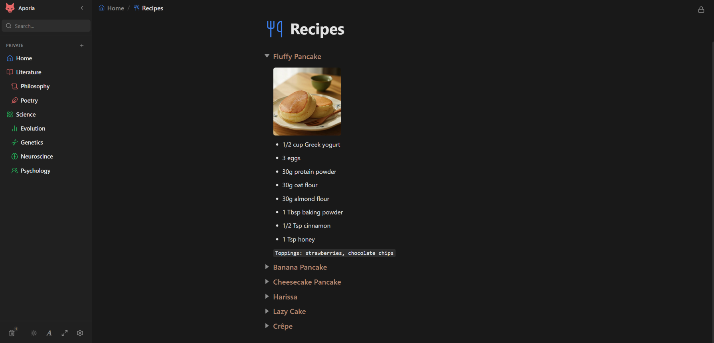
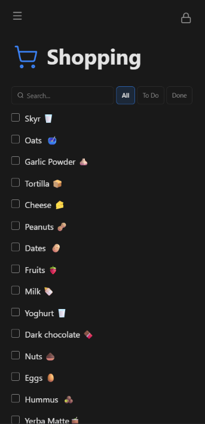
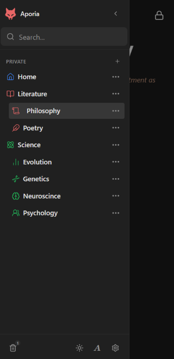

# Aporia 📝

> A minimalist, debloated Notion alternative built for personal use. Self-hosted, lightning-fast, and 100% private.

[](https://aporia.vercel.app)
[](https://svelte.dev)
[](https://www.typescriptlang.org)
[](https://www.docker.com)

---

## 💡 What is Aporia?

**Aporia** is a minimalist, debloated Notion alternative designed for personal knowledge management.

Built for speed, clarity, and simplicity, Aporia combines modern block-based editing with a **clean, lightweight, and distraction-free interface**. It strips away unnecessary feature bloat so you can focus entirely on thinking, writing, and organizing your thoughts.

* ⚡ **Lightning-Fast & Responsive:** Powered by Svelte 5 and TipTap for instant page loads and fluid, effortless editing.
* 🎯 **Clean & Distraction-Free:** A sleek, uncluttered UI focused purely on your content, tasks, and ideas.
* 🔒 **Self-Hosted & Private:** Runs on a single local SQLite database—giving you complete ownership over your data.

---

<!-- APP SHOWCASE -->
<div align="center">
  <br />
  
  <!-- Desktop Laptop Window Frame -->
  <table border="0" cellspacing="0" cellpadding="0" style="width: 100%; max-width: 850px; margin: 0 auto; border-radius: 12px; overflow: hidden; box-shadow: 0 20px 40px rgba(0,0,0,0.4);">
    <tr style="background: #181825;">
      <td style="padding: 10px 16px; border-bottom: 1px solid #313244;">
        <span style="color: #ed8796; font-size: 14px;">●</span>
        <span style="color: #eed49f; font-size: 14px;">●</span>
        <span style="color: #a6da95; font-size: 14px;">●</span>
        <span style="color: #b7bdf8; font-size: 13px; margin-left: 12px; font-family: system-ui, sans-serif; font-weight: 500;">aporia.app — Workspace & Block Editor</span>
      </td>
    </tr>
    <tr>
      <td style="background: #11111b; padding: 0;">
        
      </td>
    </tr>
  </table>
  
  <br />
  <br />

  <!-- Mobile Side-by-Side Frames -->
  <table border="0" cellspacing="20" cellpadding="0">
    <tr>
      <td align="center" valign="top">
        <div style="background: #181825; border: 3px solid #313244; border-radius: 36px; padding: 12px 10px 16px 10px; box-shadow: 0 12px 30px rgba(0,0,0,0.5); display: inline-block;">
          <div style="width: 60px; height: 5px; background: #45475a; border-radius: 3px; margin: 0 auto 10px auto;"></div>
          
        </div>
      </td>
      <td align="center" valign="top">
        <div style="background: #181825; border: 3px solid #313244; border-radius: 36px; padding: 12px 10px 16px 10px; box-shadow: 0 12px 30px rgba(0,0,0,0.5); display: inline-block;">
          <div style="width: 60px; height: 5px; background: #45475a; border-radius: 3px; margin: 0 auto 10px auto;"></div>
          
        </div>
      </td>
    </tr>
  </table>
  <br />
</div>

---

## 🚀 Live Demo

Try Aporia directly in your browser: **[aporia.vercel.app](https://aporia.vercel.app)**

> **Note for Demo Visitors:**  
> The Vercel preview runs an isolated, temporary instance. On your first visit, set up any demo username & password (e.g. `admin` / `password123`) to explore the editor, create pages, and test all features. Demo instances automatically reset after inactivity.

---

## ✨ Features

- ✍️ **Block-Based Editor:** Rich-text editing powered by TipTap with support for headings, code blocks, task lists, tables, callouts, and inline styling.
- ⚡ **Instant Full-Text Search:** Powered by SQLite FTS5 for lightning-fast search across all titles and page contents.
- 🔒 **Local-First & Self-Hosted:** Single-user authentication model with secure session management. Your data stays in your local SQLite database.
- 📥 **Notion Import & Data Backup:** Easily export/import your workspace and import from Notion.
- 🎨 **Svelte 5 & Runes:** Built on Svelte 5 for top-tier performance and fine-grained reactivity.
- 🐳 **Production Ready:** Ships with a multi-stage Dockerfile and Docker Compose configurations.

---

## 🛠️ Tech Stack

| Component | Technology |
| :--- | :--- |
| **Framework** | [SvelteKit](https://kit.svelte.dev/) + [Svelte 5](https://svelte.dev/) |
| **Editor** | [TipTap 3](https://tiptap.dev/) |
| **Database & ORM** | [SQLite](https://sqlite.org/) + [Drizzle ORM](https://orm.drizzle.team/) |
| **Bundler** | [Vite 8](https://vitejs.dev/) |
| **Deployment** | Docker / GHCR / Vercel (`adapter-auto`) |

---

## 🚀 Self-Hosting & Deployment

### 1. Publish the Image
Push your changes to GitHub. The GitHub Actions workflow (`.github/workflows/docker-publish.yml`) automatically builds and publishes the image to GitHub Container Registry (GHCR):

```text
ghcr.io/<github-owner>/aporia:latest
```

### 2. Prepare the Docker Host
Create a directory on your host for persistent SQLite storage:

```sh
mkdir -p /opt/appsstack/config/aporia
chown -R 1000:1000 /opt/appsstack/config/aporia
```

### 3. Add Service to Docker Compose
Add `aporia` to your `docker-compose.yml`:

```yaml
services:
  aporia:
    image: ghcr.io/<github-owner>/aporia:latest
    container_name: aporia
    restart: unless-stopped
    ports:
      - "127.0.0.1:3001:3000"
    environment:
      NODE_ENV: production
      HOST: 0.0.0.0
      PORT: 3000
      DATABASE_URL: /app/data/app.db
    volumes:
      - /opt/appsstack/config/aporia:/app/data
```

### 4. Authenticate to GHCR (If Repository is Private)
```sh
docker login ghcr.io
```

### 5. Start the Service
```sh
docker compose pull aporia
docker compose up -d aporia
```

Check status and logs:
```sh
docker compose ps aporia
docker compose logs -f aporia
```

> **First-Time Setup:** On initial visit, Aporia presents an account setup screen. Create your admin username and password. Once created, account registration closes automatically.

### 6. Optional: HTTPS with Caddy Reverse Proxy
Add the following site block to your `Caddyfile`:

```caddy
aporia.example.com {
    reverse_proxy 127.0.0.1:3001
}
```

Reload Caddy:
```sh
caddy validate --config /etc/caddy/Caddyfile
systemctl reload caddy
```

---

## 💻 Local Development

1. **Clone the repository:**
   ```sh
   git clone https://github.com/<github-owner>/aporia.git
   cd aporia
   ```

2. **Install dependencies:**
   ```sh
   npm install
   ```

3. **Start development server:**
   ```sh
   npm run dev
   ```

4. **Run tests:**
   ```sh
   npm run test
   ```

---

## 📄 License

MIT License.
