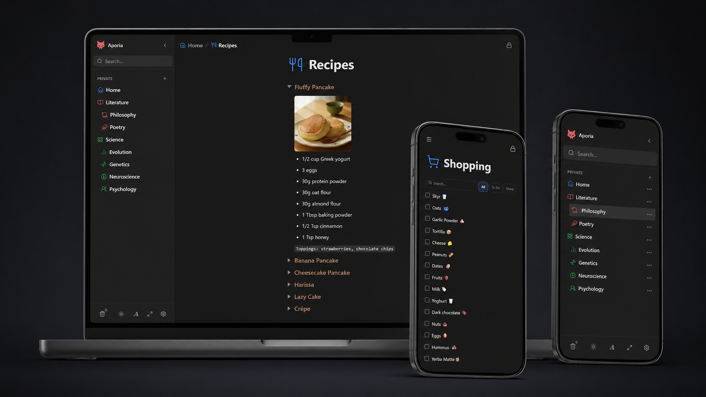

# Aporia 📝

> A minimalist, debloated Notion alternative built for personal use. Self-hosted, lightning-fast, and 100% private.

[](https://aporia-notes.vercel.app/)
[](https://svelte.dev)
[](https://www.typescriptlang.org)
[](https://www.docker.com)
[](LICENSE)

---

## 💡 What is Aporia?

**Aporia** is a minimalist, debloated Notion alternative designed for personal knowledge management.

Built for speed, clarity, and simplicity, Aporia combines modern block-based editing with a **clean, lightweight, and distraction-free interface**. It strips away unnecessary feature bloat so you can focus entirely on thinking, writing, and organizing your thoughts.

* ⚡ **Lightning-Fast & Responsive:** Powered by Svelte 5 and TipTap for instant page loads and fluid, effortless editing.
* 🎯 **Clean & Distraction-Free:** A sleek, uncluttered UI focused purely on your content, tasks, and ideas.
* 🔒 **Self-Hosted & Private:** Runs on a single local SQLite database—giving you complete ownership over your data.

---

<!-- APP SHOWCASE -->
<div align="center">
  <br />
  
  
  <br />
</div>

---

## 🚀 Live Demo

Try Aporia directly in your browser: **[aporia-notes.vercel.app](https://aporia-notes.vercel.app/)**

> **Note for Demo Visitors:**  
> The public Vercel demo opens without a login. It is a shared, disposable workspace: changes may be visible to other visitors and can reset at any time. Do not add private or sensitive information.

---

## ✨ Features

- ✍️ **Block-Based Editor:** Rich-text editing powered by TipTap with support for headings, code blocks, task lists, tables, callouts, and inline styling.
- ⚡ **Instant Full-Text Search:** Powered by SQLite FTS5 for lightning-fast search across all titles and page contents.
- 🔒 **Local-First & Self-Hosted:** Single-user authentication model with secure session management. Your data stays in your local SQLite database.
- 📥 **Notion Import & Data Backup:** Easily export/import your workspace and import from Notion.
- 🎨 **Svelte 5 & Runes:** Built on Svelte 5 for top-tier performance and fine-grained reactivity.
- 🐳 **Production Ready:** Ships with a multi-stage Dockerfile and Docker Compose configurations.

---

## 🛠️ Tech Stack

| Component | Technology |
| :--- | :--- |
| **Framework** | [SvelteKit](https://kit.svelte.dev/) + [Svelte 5](https://svelte.dev/) |
| **Editor** | [TipTap 3](https://tiptap.dev/) |
| **Database & ORM** | [SQLite](https://sqlite.org/) + [Drizzle ORM](https://orm.drizzle.team/) |
| **Bundler** | [Vite 8](https://vitejs.dev/) |
| **Deployment** | Docker / GHCR / Vercel (`adapter-auto`) |

---

## 🚀 Self-Hosting & Deployment

### 1. Create a deployment directory
On the Docker host, create a directory for Aporia and its persistent data:

```sh
mkdir -p /opt/appsstack/aporia/config/aporia
sudo chown -R 1000:1000 /opt/appsstack/aporia/config/aporia
cd /opt/appsstack/aporia
```

### 2. Create `docker-compose.yml`
Create `/opt/appsstack/aporia/docker-compose.yml` with the following contents:

```yaml
services:
  aporia:
    image: ghcr.io/kinanqaz/aporia:latest
    container_name: aporia
    restart: unless-stopped
    ports:
      - "127.0.0.1:3001:3000"
    environment:
      NODE_ENV: production
      HOST: 0.0.0.0
      PORT: 3000
      DATABASE_URL: /app/data/app.db
    volumes:
      - ./config/aporia:/app/data
```

### 3. Authenticate to GHCR (if the image is private)
```sh
docker login ghcr.io
```

Skip this step if the published image is public.

### 4. Start Aporia
```sh
docker compose pull
docker compose up -d
```

Check status and logs:
```sh
docker compose ps
docker compose logs -f aporia
```

Open `http://<your-host>:3001` in a browser. On the first visit, create the username and password for your private workspace. Account setup closes after the first account is created.

### 5. Optional: HTTPS with Caddy Reverse Proxy
Add the following site block to your `Caddyfile`:

```caddy
aporia.example.com {
    reverse_proxy 127.0.0.1:3001
}
```

Reload Caddy:
```sh
caddy validate --config /etc/caddy/Caddyfile
systemctl reload caddy
```

---

## 💻 Local Development

1. **Clone the repository:**
   ```sh
   git clone https://github.com/kinanqaz/aporia.git
   cd aporia
   ```

2. **Install dependencies:**
   ```sh
   npm install
   ```

3. **Start development server:**
   ```sh
   npm run dev
   ```

4. **Run tests:**
   ```sh
   npm run test
   ```

---

## 📄 License

Released under the [MIT License](LICENSE).
